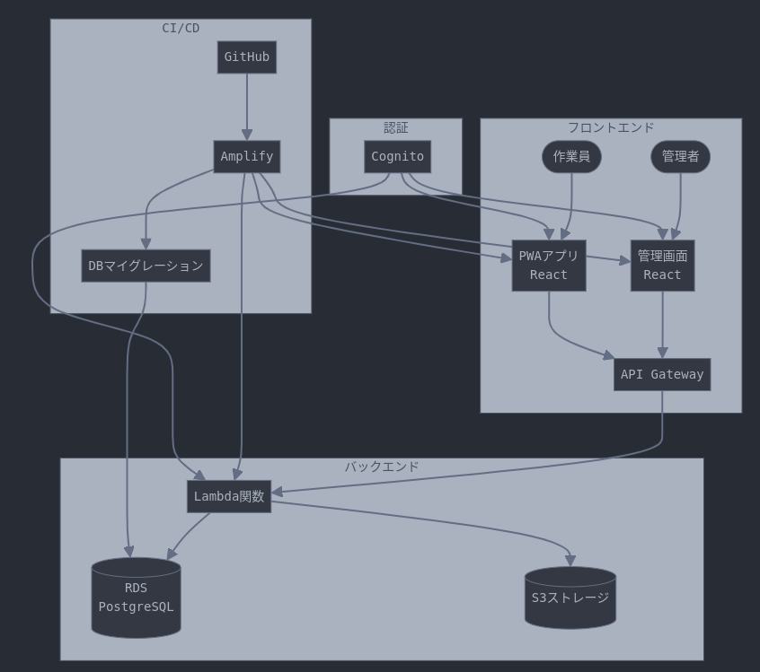

## ご相談の背景

大手製造業のお客様が以下のような課題を抱えていました：

- 複数事業部での個別AWS環境運用による非効率性
- インフラ構築・変更における属人性の高さ
- 環境間での設定の不整合
- 月額100万円を超えるAWSコストの肥大化
- セキュリティ設定の標準化の必要性
- 障害時の対応遅延

## 導入結果

本プロジェクトにより、以下のような改善を実現しました：

- クラウドコストの最適化による運用予算の効率的な活用
- インフラ構築プロセスの標準化による作業効率の向上
- 環境構築の再現性と一貫性の確保
- セキュリティ管理体制の強化
- 運用プロセスの自動化による業務効率の改善

## 主要施策

### インフラのコード化（IaC）

- Terraformによる全インフラのコード管理
- GitLabによるバージョン管理とCI/CD
- 環境ごとのワークスペース分離
- モジュール化による再利用性の向上

### コスト最適化

- リソースの自動スケーリング設定
- 未使用リソースの自動停止
- リザーブドインスタンスとSavings Plansの最適な組み合わせ
- S3ライフサイクルポリシーの導入

### 運用効率化

- AWS Organizations による一元管理
- AWS Control Tower によるガバナンス強化
- AWS Config による設定監視の自動化
- CloudWatch アラームの標準化

## アーキテクチャ説明

本プロジェクトでは以下のような構成を採用しました：

1. マルチアカウント戦略

   - AWS Organizations による階層型アカウント管理
   - 環境別（本番/検証/開発）アカウント分離
   - 共有サービス用アカウントの集約

2. ネットワーク構成

   - Transit Gateway によるハブアンドスポーク型接続
   - AWS Network Firewall による集中型セキュリティ管理
   - Direct Connect による安定した専用線接続

3. セキュリティ設計
   - AWS IAM Identity Center による統合認証
   - Security Hub による統合セキュリティ管理
   - KMS による暗号化の標準化

## システム構成図

## 実装したTerraformモジュール

主要なTerraformモジュールとして以下を実装：

1. Network Module

   - VPC
   - Subnet
   - Transit Gateway
   - Network Firewall

2. Security Module

   - IAM Roles
   - Security Groups
   - KMS Keys
   - WAF Rules

3. Monitoring Module

   - CloudWatch Alarms
   - SNS Topics
   - AWS Config Rules
   - CloudTrail設定

4. Application Module
   - Auto Scaling Groups
   - Load Balancers
   - ECS Clusters
   - RDS Instances

## コスト最適化の詳細

以下の施策により大幅なコスト削減を実現：

1. コンピューティング最適化

   - Auto Scaling による動的なリソース調整
   - Graviton2/3 プロセッサーへの移行
   - コンテナ化による利用効率向上

2. ストレージ最適化

   - S3 Intelligent-Tiering の活用
   - EBS gp3への移行
   - スナップショット世代管理の自動化

3. データ転送コスト削減
   - CloudFront の最適な利用
   - VPC Endpoint の戦略的配置
   - リージョン間転送の最小化

## 運用効率化の成果

1. 障害対応プロセスの改善

   - インシデント対応フローの標準化
   - 自動復旧機能の導入による運用負荷の軽減
   - モニタリング体制の強化

2. 変更管理の最適化

   - 環境構築プロセスの標準化
   - 承認フローの自動化による手続きの効率化
   - 変更履歴の可視化

3. セキュリティ管理の強化
   - 脆弱性対応プロセスの確立
   - コンプライアンス状況の継続的なモニタリング
   - セキュリティインシデントの予防的対策
