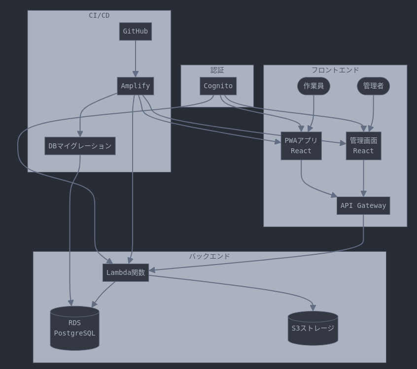

## ご相談の背景

建設業界では、以下のような課題を抱えていました：

- 紙ベースの作業報告書による非効率な業務プロセス
- 現場と事務所間のコミュニケーション遅延
- 作業進捗のリアルタイム把握が困難
- データの入力ミスや紛失のリスク
- 緊急時の情報共有の遅れ

## 導入結果

システム導入により、以下のような改善を実現しました：

- 作業報告書のデジタル化による業務プロセスの効率化
- リアルタイムな情報共有による意思決定の迅速化
- クラウドバックアップによる重要データの確実な保護
- モバイルアプリの活用による現場作業の利便性向上
- デジタル化による入力ミスの防止と品質向上

## 主要機能

### 管理者用Webアプリケーション

- 作業員管理
- 作業指示書発行
- データ入出力管理
- ダッシュボード機能
- データ分析

### 現場作業員用PWAアプリケーション

- 作業報告書作成
- オフライン対応
- リアルタイム同期
- プッシュ通知

## アーキテクチャ説明

システムは以下の主要コンポーネントで構成されています：

1. フロントエンド

   - ReactベースのSPAアプリケーション
   - Remixフレームワークを使用
   - Tailwind CSSによるレスポンシブデザイン

2. バックエンド
   - AWS Amplify CDKで構築されたサーバーレスアーキテクチャ
   - AWS Lambdaを使用したイベント駆動型マイクロサービス
   - Prismaによるデータベース操作
   - API GatewayによるREST API管理

## システム構成図

## 使用しているAWSサービス

本システムでは以下のAWSサービスを活用しています：

1. AWS Lambda

   - サーバーレス関数によるバックエンド処理
   - イベント駆動型アーキテクチャ
   - 自動スケーリングと高可用性を実現

2. Amazon Cognito

   - ユーザー認証と認可管理
   - 多要素認証のサポート

3. Amazon S3

   - ファイルストレージ
   - 作業報告書の添付ファイル管理

4. Amazon RDS (PostgreSQL)

   - リレーショナルデータベース
   - データの永続化とトランザクション管理

5. AWS Amplify
   - フロントエンドアプリケーションのデプロイ
   - CI/CDパイプラインの構築
   - CDKによるインフラストラクチャのコード管理
